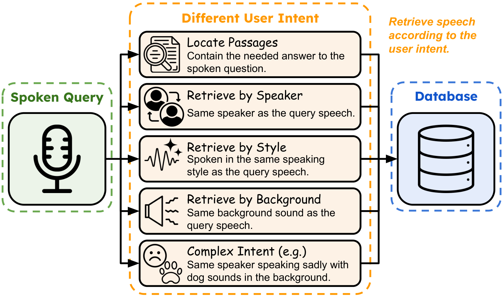

<div align="center">

# INSPIRE: A Benchmark for Instruction-Aware Speech Retrieval

[](https://huggingface.co/datasets/lca0503/INSPIRE)
[](https://arxiv.org/abs/2608.16203)

<p>
A benchmark for retrieving spoken documents with natural-language instructions
that describe content, speaker identity, speaking style, environmental sound,
or combinations of these attributes.
</p>

<p align="center">

</p>

</div>

## Table of Contents

- [Benchmark](#benchmark)
- [Installation](#installation)
- [Supported methods](#supported-methods)
- [Usage](#usage)
  - [LALM embeddings](#lalm-embeddings)
  - [Cascaded text retrieval](#cascaded-text-retrieval)
  - [SSL and CLAP](#ssl-and-clap)
  - [Reranking](#reranking)
  - [Calculating retrieval scores](#calculating-retrieval-scores)
- [Outputs and evaluation](#outputs-and-evaluation)
- [Citation](#citation)

## Benchmark

Given a spoken query and a natural-language instruction, a system must rank
spoken documents according to the attributes requested by that instruction.
INSPIRE provides separate Hugging Face `query` and `document` configurations;
each subset forms an independent retrieval corpus.

| Subset | Query-instruction pairs | Documents | Main criteria |
| --- | ---: | ---: | --- |
| DailyTalk | 200 | 4,882 | Dialogue continuation |
| VCTK | 80 | 3,082 | Speaker |
| Expresso | 800 | 3,861 | Speaker and speaking style |
| Synthetic | 3,000 | 5,400 | Semantics, speaker, style, and environment |

Each query contains:

- `instruction`: the natural-language retrieval criterion.
- `positive_documents`: IDs of relevant documents.
- `excluded_ids`: documents omitted from that query's candidate pool.
- Speech content and attribute metadata used for analysis.

Document IDs are zero-padded strings such as `"00042"`. Queries and documents
should only be compared within the same subset.

## Installation

Create the environment and install all model, API, BM25, and GPU backends:

```bash
conda create -n inspire python=3.13 openjdk=21 ffmpeg pip
conda activate inspire
pip install -r requirements.txt
```

OpenJDK supports the Pyserini BM25 backend, while FFmpeg supports dataset audio
decoding. Set `OPENAI_API_KEY` or `GEMINI_API_KEY` only when using the
corresponding hosted models.

## Supported methods

| Method | Scripts |
| --- | --- |
| LALM embeddings | `extractor/` |
| ASR and audio captioning | `captioner/` |
| Dense and BM25 text retrieval | `text_extractor/` |
| HuBERT, WavLM, and CLAP | `ssl_extractor/` |
| Oracle metadata baselines | `oracle_extractor/` |
| Audio and text reranking | `reranker/` |
| Random baseline | `random_baseline.py` |
| Retrieval scoring and CSV export | `calculate_score.py` |

Supported model families include Audio-Flamingo-3, Qwen2.5-Omni, Qwen3-Omni,
Voxtral, Whisper, HuBERT, WavLM, CLAP, Qwen3 embedding and reranking models,
OpenAI, and Gemini.

Run any script with `--help` for its complete arguments.

## Usage

### LALM embeddings

```bash
python extractor/af3_extractor.py \
    --model_name <checkpoint> \
    --output_dir outputs/af3

python calculate_score.py \
    --queries_representation_dir outputs/af3/queries \
    --documents_representation_dir outputs/af3/documents \
    --output_dir outputs/af3_scores \
    --export_file outputs/af3_scores.csv
```

Qwen2.5-Omni, Qwen3-Omni, and Voxtral use the corresponding scripts in
`extractor/`. Use `--mean_pooling` for mean pooling or `--no_instruction` for
the instruction-free setting.

### Cascaded text retrieval

Generate transcriptions and captions:

```bash
python captioner/whisper_asr.py \
    --output_dir outputs/transcriptions

python captioner/qwen3omni_captioner.py \
    --model_name <checkpoint> \
    --output_dir outputs/captions
```

Then run dense, instruction-aware, or BM25 retrieval:

```bash
python text_extractor/dense_extractor.py \
    --model_name <checkpoint> \
    --transcriptions_dir outputs/transcriptions \
    --captions_dir outputs/captions \
    --output_dir outputs/dense

python text_extractor/instruction_extractor.py \
    --model_name <checkpoint> \
    --transcriptions_dir outputs/transcriptions \
    --captions_dir outputs/captions \
    --output_dir outputs/instruction

python text_extractor/bm25_retriever.py \
    --transcriptions_dir outputs/transcriptions \
    --captions_dir outputs/captions \
    --output_dir outputs/bm25_scores
```

BM25 writes score files directly. Dense extractors produce representations that
are passed to `calculate_score.py`.

### SSL and CLAP

```bash
python ssl_extractor/ssl_extractor.py \
    --model_name facebook/hubert-large-ll60k \
    --layer -1 \
    --output_dir outputs/hubert
```

For CLAP, run `clap_extractor.py --mode text` for queries and `--mode audio`
for documents. This gives the benchmark's T→A configuration. The same script
also supports A→A, A→T, and T→T.

### Reranking

Rerankers read the top 100 IDs from first-stage score files:

```bash
python reranker/qwen25omni_reranker.py \
    --model_name <checkpoint> \
    --input_dir outputs/first_stage_scores \
    --output_dir outputs/reranked
```

The toolkit also supports AF3, Qwen3-Omni, Voxtral, and Qwen3 text rerankers.

### Calculating retrieval scores

Use `calculate_score.py` for methods that produce NumPy query and document
representations:

```bash
python calculate_score.py \
    --queries_representation_dir outputs/my_method/queries \
    --documents_representation_dir outputs/my_method/documents \
    --output_dir outputs/my_method/scores \
    --export_file outputs/my_method/scores.csv \
    --export_by_relevance_file outputs/my_method/scores_by_relevance.csv
```

- The query and document paths must each contain `DailyTalk`, `Expresso`,
  `VCTK`, and `Synthetic` subdirectories with `.npy` representations.
- Query filenames must match zero-padded query IDs; document filenames must
  match document audio IDs. Query and document vectors must have equal sizes.
- The scorer removes `excluded_ids`, ranks documents by cosine similarity, and
  writes per-query Recall@k and NDCG@k to `<output_dir>/<split>/score.jsonl`.
- Use `--k_values 10 20 50` to change the default cutoffs. The two export
  arguments are optional. BM25 and rerankers already write score files and do
  not need `calculate_score.py`.

## Outputs and evaluation

Representations and generated text use:

```text
<output-dir>/queries/<split>/<query-id>.{npy,txt}
<output-dir>/documents/<split>/<audio-id>.{npy,txt}
```

Scores use:

```text
<score-dir>/<split>/score.jsonl
```

The default metrics are Recall@k and NDCG@k for k = 1, 5, 10, 20, 50, and
100. See [Calculating retrieval scores](#calculating-retrieval-scores) for the
complete evaluation command and export options.

Excluded documents are removed before ranking. Exact cosine-similarity ties are
shuffled using the provided seed rather than ordered by document ID.

## Citation

If you find our code or models helpful, please consider citing our paper using
the following BibTeX:

```bibtex
@article{li2026inspire,
  title   = {INSPIRE: A Benchmark for Instruction-Aware Speech Retrieval},
  author  = {Li, Chen-An and Lee, Hung-yi},
  journal = {arXiv preprint arXiv:2608.16203},
  year    = {2026}
}
```
